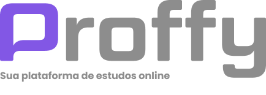

<p align='center'></p>
<h1 align='center'>Proffy</h1>
<p align='center'>


</p>

</div>

---

## 📋 Índice

- [Descrição](#-Descrição)
- [Tecnologias utilizadas](#-Tecnologias-utilizadas)
- [Layout](#-Layout)
- [Licença](#-Licença)
- [Como executar o projeto](#-Como-executar-o-projeto)

---

## 📖 Descrição

Este é um projeto desenvolvido durante a **[Next Level Week](https://nextlevelweek.com/)**, realizada pela **[@Rocketseat](https://github.com/Rocketseat)** durante os dias 3 a 9 de Agosto de 2020.

A proposta do projeto é uma aplicação que possa ligar quem deseja aprender, com quer ensinar. É possível encontrar alunos para o que você leciona, ou encontrar o professor para aquela matéria que você sempre quis aprender mais! Sem que haja nenhuma limitação de área!! 

--- 

## 🚀 Tecnologias Utilizadas
- HTML
- CSS
- JavaScript
- Node.js 
- Nunjucks 
- SQLite 

--- 

<h3>🖥 Layout</h3>


--- 

## 📝 Licença
<p>O projeto se encontra sob licença MIT. Para mais detalhes, acesse <a href='LICENSE'>license<a>.</p>

--- 

## ⌨ Como executar o projeto

```bash
# Clonar o repositório
git clone https://github.com/ndesouz1/nextlevelweek-proffy.git

# Entrar no diretório
cd nextlevelweek-proffy

# Baixar as dependências
npm i

# Executar o servidor
npm run dev
```

Feito isso, abra o seu navegador e acesse `http://localhost:5500/`

---

<p>Criado com ❤️ por <a href='https://github.com/ndesouz1/' target='_blank'>Nayara de Souza</a></p>
